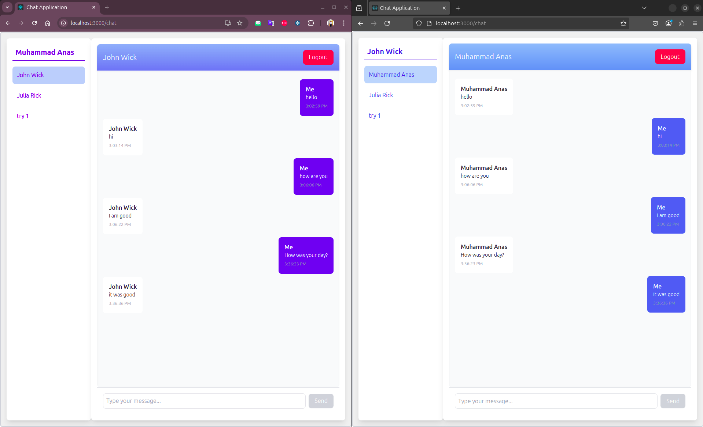

# Real-Time Chat Application

## Overview
This project is a real-time chat application built using React.js, Node.js, Express, and Socket.IO. It enables users to sign up, log in, and exchange messages in real-time. Additionally, the frontend includes an animated 3D sphere effect using Three.js that reacts when a message is sent.

## Tech Stack
### Backend:
- **Node.js** & **Express**: For handling HTTP requests and authentication.
- **Socket.IO**: For real-time communication.
- **JSON-RPC 2.0**: For fetching users and messages.
- **File-Based Storage**: Users and messages are stored in JSON files (`users.json` & `chat.json`).

### Frontend:
- **React.js**: For building the UI.
- **Redux**: For managing global state.
- **Tailwind CSS**: For styling.
- **Three.js**: For rendering the animated sphere in the chat interface.

## Installation & Setup

### Prerequisites:
Ensure you have the following installed:
- Node.js (v14+)
- npm or yarn

### Backend Setup:
1. Navigate to the backend folder:
   ```sh
   cd backend
   ```
2. Install dependencies:
   ```sh
   npm install
   ```
3. Start the backend server:
   ```sh
   npm start
   ```
   The server will run on `http://localhost:5000`

### Frontend Setup:
1. Navigate to the frontend folder:
   ```sh
   cd frontend
   ```
2. Install dependencies:
   ```sh
   npm install
   ```
3. Start the frontend server:
   ```sh
   npm start
   ```
   The frontend will run on `http://localhost:3000`

## Features
- **User Authentication**: Sign up and log in with email and password.
- **Real-Time Messaging**: Send and receive messages instantly using Socket.IO.
- **User List**: View available users to chat with.
- **Animated Sphere Effect**: A 3D sphere appears and animates when a message is sent.

## API Routes
### Auth Routes:
- **POST /signup** - Create a new user.
- **POST /login** - Authenticate a user.

### JSON-RPC Endpoints:
- **getUsers** - Retrieve a list of users.
- **getMessages** - Fetch messages between two users.

### Socket.IO Events:
- **register_user** - Registers a user’s socket ID.
- **send_message** - Sends a new message.
- **receive_message** - Listens for incoming messages.

## Expected Behavior
1. Users can sign up and log in.
2. They can see a list of available users and select one to chat with.
3. Messages are sent in real-time and stored in `chat.json`.
4. A 3D animated sphere effect is triggered when a message is sent.
5. The chat is persistent, meaning messages remain available after a refresh.

## Screenshot
Below is an example of the real-time chat in action:




---
### Enjoy chatting in real-time with this interactive messaging application! 🚀

